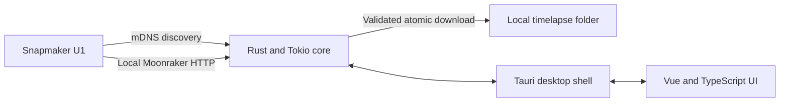
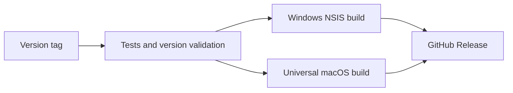

<div align="center">
  

  <h1>SnapSync</h1>

  <p>
    <strong>Local-first timelapse sync for the Snapmaker U1.</strong>
  </p>
  <p>
    Discover your printer, automate downloads, and keep every timelapse organized
    on Windows and macOS — without sending anything to the cloud.
  </p>

  <p>
    <a href="https://github.com/doutorinfamous/snapsync/actions/workflows/ci.yml">
      
    </a>
    <a href="https://github.com/doutorinfamous/snapsync/releases/latest">
      
    </a>
    <a href="https://github.com/doutorinfamous/snapsync/releases">
      
    </a>
    <a href="LICENSE">
      
    </a>
    
  </p>

  <p>
    <a href="https://github.com/doutorinfamous/snapsync/releases/latest">
      
    </a>
    <a href="https://github.com/doutorinfamous/snapsync/releases/latest">
      
    </a>
  </p>
</div>

---

## Overview

SnapSync is an open-source desktop companion for the
[Snapmaker U1](https://www.snapmaker.com/en/snapmaker-u1). It connects directly
to the printer over your local network, finds new timelapse videos, validates
each download, and stores it in the folder you choose.

> [!IMPORTANT]
> SnapSync is an independent community project. It is not affiliated with,
> endorsed by, or supported by Snapmaker.

### Built around three principles

<table>
  <tr>
    <td width="33%" align="center">
      <strong>Local first</strong><br />
      No cloud relay, telemetry, or third-party upload.
    </td>
    <td width="33%" align="center">
      <strong>Safe by design</strong><br />
      Atomic transfers, size validation, and host-locked URLs.
    </td>
    <td width="33%" align="center">
      <strong>Set and forget</strong><br />
      Background schedules, tray mode, and persistent deduplication.
    </td>
  </tr>
</table>

## Highlights

<table>
  <tr>
    <td width="50%">
      <strong>Automatic discovery</strong><br />
      Finds U1 printers through mDNS, with direct IP fallback.
    </td>
    <td width="50%">
      <strong>Reliable transfers</strong><br />
      Downloads to a temporary file and validates its size before completion.
    </td>
  </tr>
  <tr>
    <td width="50%">
      <strong>Smart deduplication</strong><br />
      Skips known videos while confirming the local copy still exists.
    </td>
    <td width="50%">
      <strong>Background operation</strong><br />
      Runs on a configurable schedule and stays available in the system tray.
    </td>
  </tr>
  <tr>
    <td width="50%">
      <strong>Visual history</strong><br />
      Tracks downloaded, skipped, and failed transfers in one clean interface.
    </td>
    <td width="50%">
      <strong>Optional thumbnails</strong><br />
      Saves a JPG preview next to each downloaded video.
    </td>
  </tr>
</table>

SnapSync only reads files from the printer. It never deletes remote timelapses.

## How it works



1. SnapSync discovers the U1 through `_snapmaker._tcp.local.` or uses the IP you
   provide.
2. It queries `/server/files/list?root=camera` through the local Moonraker API.
3. New videos are downloaded as `.part` files.
4. SnapSync validates the received size and then atomically renames the file.
5. Persistent history prevents unnecessary downloads on future syncs.

## Technology stack

<div align="center">
  <p>
    
    
    
    
    
    
  </p>
</div>

| Layer | Technology | Responsibility |
|---|---|---|
| Interface | [Vue 3](https://vuejs.org/) + [TypeScript](https://www.typescriptlang.org/) | Reactive desktop UI and type-safe IPC contracts |
| Tooling | [Vite](https://vite.dev/) | Fast development server and optimized frontend builds |
| Desktop | [Tauri 2](https://v2.tauri.app/) | Native windows, tray integration, autostart, and installers |
| Core | [Rust](https://www.rust-lang.org/) + [Tokio](https://tokio.rs/) | Discovery, scheduling, downloads, and persistence |
| Printer | mDNS + [Moonraker HTTP API](https://moonraker.readthedocs.io/) | Local discovery and timelapse access |
| Delivery | [GitHub Actions](https://github.com/features/actions) | Tested Windows EXE and universal macOS DMG releases |

## Download and install

Get the newest build from
**[GitHub Releases](https://github.com/doutorinfamous/snapsync/releases/latest)**.

### Windows

1. Download `SnapSync_*_x64-setup.exe`.
2. Run the NSIS installer.
3. Open SnapSync from the Start menu.

### macOS

1. Download `SnapSync_*_universal.dmg`.
2. Open the DMG and move SnapSync to **Applications**.
3. Launch SnapSync from **Applications**.

> [!WARNING]
> Current builds are not code-signed. Windows SmartScreen or macOS Gatekeeper
> may display a warning. On macOS, use **System Settings → Privacy & Security →
> Open Anyway** after the first blocked launch. Signing and Apple notarization
> are planned.

## Quick start

1. Open **Settings → Printer**.
2. Select **Search network**, or enter the U1 IP address manually.
3. Select **Test** to verify the connection.
4. Under **General**, choose a destination folder.
5. Select **Sync now** or enable automatic synchronization.

## Requirements

- [Snapmaker U1](https://www.snapmaker.com/en/snapmaker-u1)
- Windows 10 or newer, or macOS 10.15 or newer
- Computer and printer connected to the same local network
- Local firewall access:
  - UDP `5353` for mDNS discovery
  - TCP `7125` for Moonraker
  - TCP `8080` for the U1 download fallback

## Development

### Prerequisites

- Node.js 20 or newer
- Stable Rust toolchain
- Tauri 2 system dependencies
- Windows: Visual Studio Build Tools with C++ and WebView2
- macOS: Xcode Command Line Tools

### Run locally

```sh
npm ci
npm run tauri dev
```

### Validate

```sh
npm run check
cargo clippy --manifest-path src-tauri/Cargo.toml --all-targets -- -D warnings
```

### Build an installer

```sh
npm run tauri build
```

Native packages must be created on their target operating system. Windows
produces an NSIS `.exe`; macOS produces a `.dmg`.

## Automated releases

Every `vX.Y.Z` tag on `main` starts the cross-platform release pipeline:



To publish a future version:

1. Set the same `X.Y.Z` version in `package.json`, `src-tauri/Cargo.toml`, and
   `src-tauri/tauri.conf.json`.
2. Merge the version change into `main`.
3. Create and push the matching tag:

```sh
git tag vX.Y.Z
git push origin vX.Y.Z
```

The release stays in draft mode until both installers finish successfully.

## Privacy and security

- Communication stays on your local network.
- No analytics or cloud relay is used.
- Timelapses are never uploaded to a third party.
- Logs do not contain video contents or credentials.
- Printer-provided URLs are restricted to the configured printer host.

The proprietary U1 camera service is not included in this repository.

## Contributing

Issues and focused pull requests are welcome. Before opening a pull request:

```sh
npm run check
cargo clippy --manifest-path src-tauri/Cargo.toml --all-targets -- -D warnings
```

## Developed by

<div align="center">
  <a href="https://github.com/doutorinfamous">
    
  </a>
</div>

SnapSync is developed and maintained by
**[Papai Nerd](https://github.com/doutorinfamous)**.

### References

- [Snapmaker U1 official product page](https://www.snapmaker.com/en/snapmaker-u1)
- [Snapmaker U1 Wiki](https://wiki.snapmaker.com/en/snapmaker_u1)
- [Moonraker](https://github.com/Arksine/moonraker)
- [Tauri](https://github.com/tauri-apps/tauri)

## License

SnapSync is free and open-source software licensed under the
[GNU General Public License v3.0](LICENSE).

<div align="center">
  <sub>Built for makers who want their timelapses local, organized, and under their control.</sub>
</div>
